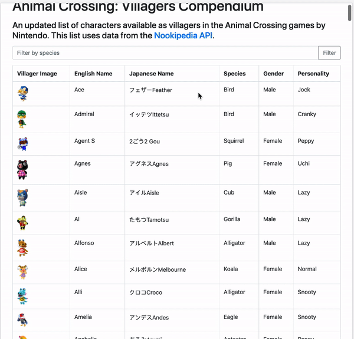

# discover-animal-crossing-villagers
An API built on top of the Nookipedia API (which makes use of MediaWiki's API) that scraps villager information form the text on the page and allows the user to filter based on species in the front end.

Serverless Golang API uses the AWS Lambda connected to API Gateway. The front end is hosted from an S3 bucket.

