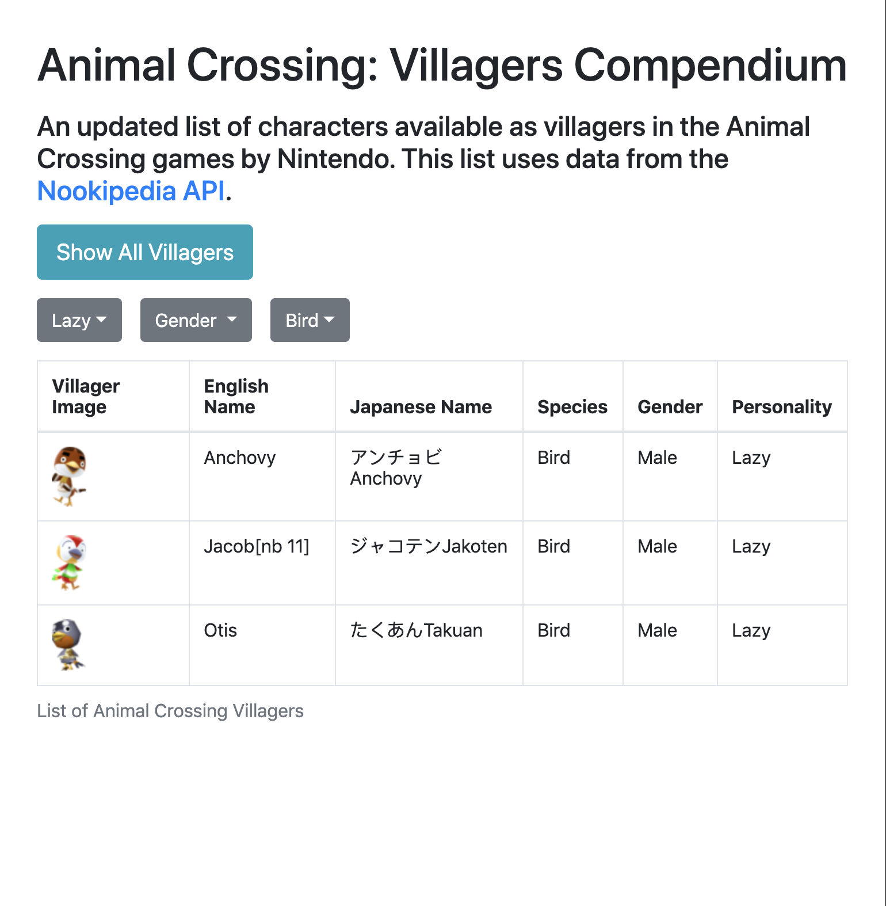

# discover-animal-crossing-villagers
This project was created solely for learning purposes. There are various optimizations and changes I would make in order to make data retrieval faster and less expensive. For instance, this data could live inside a database rather than each time making the Lambda call which gathers the data from the Nookipedia API.

This project API built on top of the Nookipedia API (which makes use of MediaWiki's API) that scraps villager information from the text on the page and allows the user to filter based on specific attributes in the front end.

Serverless Golang API uses AWS Lambda function connected to an API Gateway. The front end is hosted from an S3 bucket.

The goquery library is used for retrieving information from the tables on the wiki page. Keep in mind that changes to the structure of the Animal Crossing wiki page could happen at anytime, resulting in the program ending with issues and/or an error. The villager information is available in the raw format in the test_input folder.

https://github.com/PuerkitoBio/goquery

